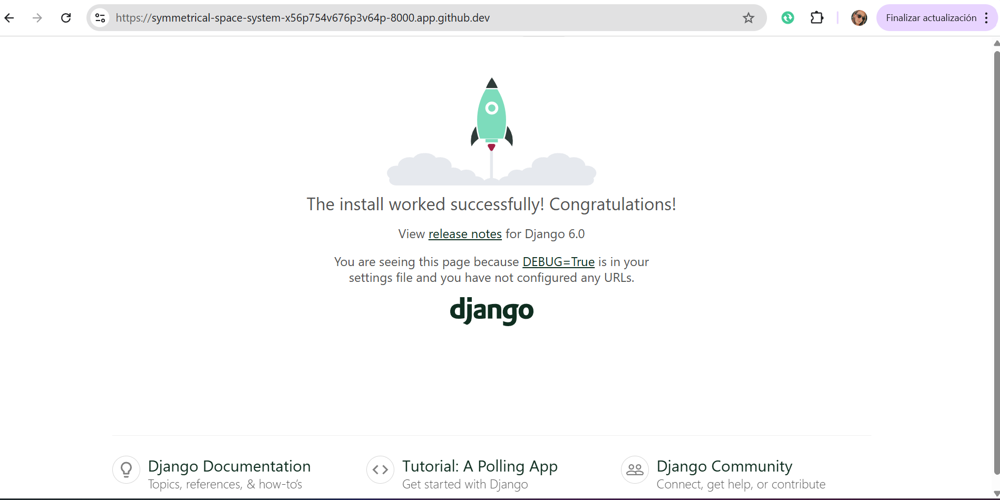
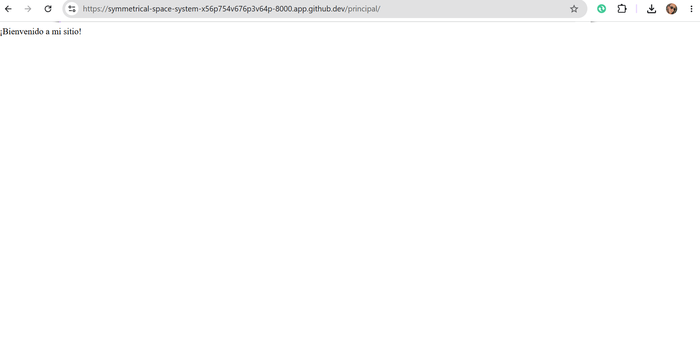

# Proyecto Django: mi_sitio

## 1. Instalación en entorno virtual

Para aislar las dependencias del proyecto se creó un entorno virtual con los siguientes comandos:

```bash
python -m venv venv
source venv/bin/activate
pip install django
django-admin --version
```

### Explicación de cada comando

| Comando | ¿Qué ocurre? |
|---|---|
| `python -m venv venv` | Crea un entorno virtual llamado `env/` con su propio intérprete Python y espacio aislado para paquetes |
| `source venv/bin/activate` | Activa el entorno virtual, redirigiendo el `python` y `pip` del sistema al entorno aislado |
| `pip install django` | Descarga e instala Django y sus dependencias dentro del entorno virtual |
| `django-admin --version` | Muestra la versión instalada de Django (6.0.5) para verificar que se instaló correctamente |

### ¿Qué es pip?

**pip** es el gestor de paquetes oficial de Python. Permite instalar, actualizar y eliminar librerías y paquetes de terceros desde el Python Package Index (PyPI) de forma sencilla.

### ¿Qué ventajas ofrece instalar Django dentro de un entorno virtual?

1. **Aislamiento**: Cada proyecto tiene sus propias dependencias sin interferir con otros proyectos o con el sistema operativo.
2. **Versiones específicas**: Se pueden usar diferentes versiones de Django (o cualquier paquete) en distintos proyectos.
3. **Reproducibilidad**: Las dependencias se pueden congelar en un `requirements.txt` para replicar el entorno en otras máquinas.
4. **Seguridad**: No es necesario instalar paquetes a nivel global, evitando conflictos con herramientas del sistema.

---

## 2. Crear el proyecto

Se ejecutó el comando:

```bash
django-admin startproject mi_sitio
```

### Estructura generada

```
mi_sitio/
├── manage.py
├── mi_sitio/
│   ├── __init__.py
│   ├── asgi.py
│   ├── settings.py
│   ├── urls.py
│   └── wsgi.py
└── db.sqlite3
```

### Explicación de cada elemento

| Archivo / Carpeta | Propósito |
|---|---|
| **manage.py** | Utilidad de línea de comandos para interactuar con el proyecto (ejecutar servidor, migraciones, crear apps, etc.). No debe modificarse manualmente. |
| **mi_sitio/__init__.py** | Archivo vacío que indica a Python que el directorio `mi_sitio/` debe tratarse como un paquete. |
| **mi_sitio/settings.py** | Configuración principal del proyecto: bases de datos, apps instaladas, middlewares, plantillas, etc. |
| **mi_sitio/urls.py** | Define las rutas (URLs) del proyecto y las asocia a las vistas correspondientes. |
| **mi_sitio/asgi.py** | Punto de entrada para servidores ASGI (Asynchronous Server Gateway Interface). Usado para despliegue con servidores asíncronos. |
| **mi_sitio/wsgi.py** | Punto de entrada para servidores WSGI (Web Server Gateway Interface). Usado para despliegue en producción (Apache, Nginx + Gunicorn, etc.). |

---

## 3. Ejecutar el servidor

Para iniciar el servidor de desarrollo se ejecutó:

```bash
python manage.py runserver
```

### Resultado

El servidor se inició correctamente en `http://127.0.0.1:8000/`.


**Evidencia de funcionamiento:**



---

## 4. Crear una aplicación

Se creó una aplicación llamada `principal` con:

```bash
python manage.py startapp principal
```

### Diferencia entre proyecto y aplicación en Django

- **Proyecto**: Es el contenedor global que agrupa la configuración, las URLs raíz y las aplicaciones. Representa el sitio web completo.
- **Aplicación**: Es un módulo independiente y reutilizable que implementa una funcionalidad específica (un blog, un foro, un sistema de usuarios, etc.). Un proyecto puede contener múltiples aplicaciones.

### Carpetas generadas dentro de `principal/`

```
principal/
├── __init__.py        # Marca el directorio como paquete Python
├── admin.py           # Configuración del panel de administración
├── apps.py            # Configuración de la aplicación (nombre, etiqueta, etc.)
├── migrations/        # Migraciones de la base de datos
│   └── __init__.py
├── models.py          # Definición de modelos (tablas de la BD)
├── tests.py           # Pruebas unitarias
└── views.py           # Vistas (lógica que responde a las peticiones HTTP)
```

---

## 5. Configuración del proyecto

### Agregar `principal` a `INSTALLED_APPS`

En `mi_sitio/settings.py` se añadió `"principal"` a la lista `INSTALLED_APPS`:

```python
INSTALLED_APPS = [
    "django.contrib.admin",
    "django.contrib.auth",
    "django.contrib.contenttypes",
    "django.contrib.sessions",
    "django.contrib.messages",
    "django.contrib.staticfiles",
    "principal",
]
```

### Crear `urls.py` dentro de la app

Se creó el archivo `principal/urls.py` para definir las rutas propias de la aplicación:

```python
from django.urls import path
from . import views

urlpatterns = [
    path("", views.home, name="home"),
]
```

### Configurar el enrutamiento global

En `mi_sitio/urls.py` se importó `include` y se agregó la redirección hacia la app:

```python
from django.contrib import admin
from django.urls import path, include

urlpatterns = [
    path("admin/", admin.site.urls),
    path("principal/", include("principal.urls")),
]
```

### Vista con HttpResponse

En `principal/views.py` se creó una vista simple que devuelve un mensaje de bienvenida:

```python
from django.http import HttpResponse

def home(request):
    return HttpResponse("¡Bienvenido a mi sitio!")
```

### Resultado final

Al acceder a `http://127.0.0.1:8000/principal/` se muestra el mensaje **"¡Bienvenido a mi sitio!"** confirmando que la configuración es correcta.

